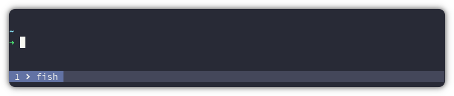
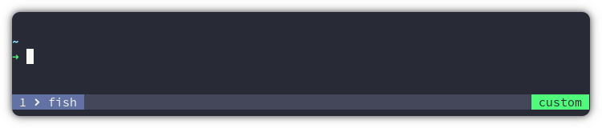
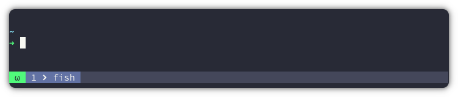
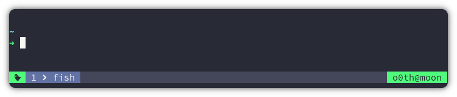
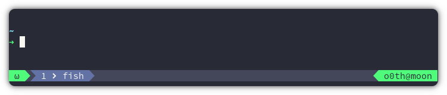
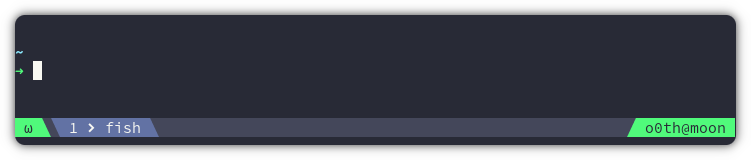
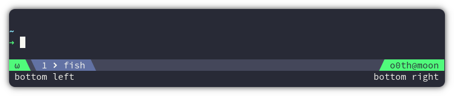

## Documentation 

### Pane

Pane content

<p align="center">
  <a></a>
</p>

```bash
# default: "#S:#I:#W"
set -g @nova-pane "#I#{?pane_in_mode,  #{pane_mode},}  #W"
```

Pane position

<p align="center">
  <a></a>
</p>

```bash
# one of: "left", "right", "centre", "absolute-centre"; default: "left"
set -g @nova-pane-justify "centre"
```

### Segments

Create a custom segment

<p align="center">
  <a></a>
</p>

```bash
# this will create a new segment named 'custom'
set -g @nova-segment-custom "custom"
set -g @nova-segment-custom-colors "#50fa7b #282a36"

# this will position the custom segment on the right side
set -g @nova-segments-0-left ""
set -g @nova-segments-0-right "custom"
```

Mode segment

<p align="center">
  <a></a>
</p>

```bash
set -g @nova-segment-mode "#{?client_prefix,Ω,ω}"
set -g @nova-segment-mode-colors "#50fa7b #282a36"

set -g @nova-segments-0-left "mode"
set -g @nova-segments-0-right ""
```

Whoami segment

<p align="center">
  <a></a>
</p>

```bash
set -g @nova-segment-mode "#{?client_prefix,Ω,ω}"
set -g @nova-segment-mode-colors "#50fa7b #282a36"

set -g @nova-segment-whoami "#(whoami)@#h"
set -g @nova-segment-whoami-colors "#50fa7b #282a36"

set -g @nova-segments-0-left "mode"
set -g @nova-segments-0-right "whoami"
```

### Nerdfonts

Default

<p align="center">
  <a></a>
</p>

```bash
# one of: true, false; default: false
set -g @nova-nerdfonts true
```

Custom

<p align="center">
  <a></a>
</p>

```bash
# one of: true, false; default: false
set -g @nova-nerdfonts true
set -g @nova-nerdfonts-left 
set -g @nova-nerdfonts-right 
```

### Rows

Define how many status line to show.

<p align="center">
  <a></a>
</p>

```bash
# one of: 0, 1, 2, 3, 4; default: 0
set -g @nova-rows 1

set -g @nova-segment-bleft "bottom left"
set -g @nova-segment-bleft-colors "#282a36 #f8f8f2"

set -g @nova-segment-bright "bottom right"
set -g @nova-segment-bright-colors "#282a36 #f8f8f2"

set -g @nova-segments-1-left "bleft"
set -g @nova-segments-1-right "bright"
```
