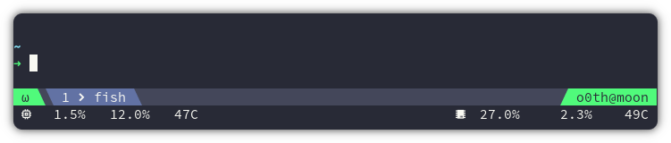
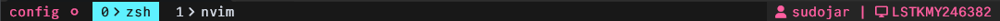

### o0th

<p align="center">
  <a></a>
</p>

```bash
set -g @plugin 'o0th/tmux-nova'

set -g @nova-nerdfonts true
set -g @nova-nerdfonts-left 
set -g @nova-nerdfonts-right 

set -g @nova-segment-mode "#{?client_prefix,Ω,ω}"
set -g @nova-segment-mode-colors "#50fa7b #282a36"

set -g @nova-segment-whoami "#(whoami)@#h"
set -g @nova-segment-whoami-colors "#50fa7b #282a36"

set -g @nova-pane "#I#{?pane_in_mode,  #{pane_mode},}  #W"

set -g @cpu_percentage_format "%5.1f%%"
set -g @nova-segment-cpu " #(~/.tmux/plugins/tmux-cpu/scripts/cpu_percentage.sh)"
set -g @nova-segment-cpu-colors "#282a36 #f8f8f2"

set -g @cpu_temp_unit "C"
set -g @cpu_temp_format "%3.0f"
set -g @nova-segment-cpu-temp "#(~/.tmux/plugins/tmux-cpu/scripts/cpu_temp.sh)"
set -g @nova-segment-cpu-temp-colors "#282a36 #f8f8f2"

set -g @ram_percentage_format "%5.1f%%"
set -g @nova-segment-ram "#(~/.tmux/plugins/tmux-cpu/scripts/ram_percentage.sh)"
set -g @nova-segment-ram-colors "#282a36 #f8f8f2"

set -g @gpu_percentage_format "%5.1f%%"
set -g @nova-segment-gpu "󰘚 #(~/.tmux/plugins/tmux-cpu/scripts/gpu_percentage.sh)"
set -g @nova-segment-gpu-colors "#282a36 #f8f8f2"

set -g @gpu_temp_unit "C"
set -g @gpu_temp_format "%3.0f"
set -g @nova-segment-gpu-temp "#(~/.tmux/plugins/tmux-cpu/scripts/gpu_temp.sh)"
set -g @nova-segment-gpu-temp-colors "#282a36 #f8f8f2"

set -g @gram_percentage_format "%5.1f%%"
set -g @nova-segment-gram "#(~/.tmux/plugins/tmux-cpu/scripts/gram_percentage.sh)"
set -g @nova-segment-gram-colors "#282a36 #f8f8f2"

set -g @nova-rows 1
set -g @nova-segments-0-left "mode"
set -g @nova-segments-0-right "whoami"
set -g @nova-segments-1-left "cpu ram cpu-temp"
set -g @nova-segments-1-right "gpu gram gpu-temp"
```

---

### gruvbox

<p align="center">
  <a></a>
</p>

```bash
### PLUGINS ###
set -g @plugin 'o0th/tmux-nova'
set -g @plugin 'tmux-plugins/tmux-cpu'
set -g @plugin 'tmux-plugins/tmux-battery'
set -g @plugin 'ofirgall/tmux-keyboard-layout'

### THEME ###
set -g @nova-nerdfonts true
set -g @nova-nerdfonts-left 
set -g @nova-nerdfonts-right 

set -g @nova-pane "#I #W"
set -g @nova-rows 0

### COLORS ###
b_bg="#504945"

seg_a="#a89984 #282828"
seg_b="$b_bg #ddc7a1"

inactive_bg="#32302f"
inactive_fg="#ddc7a1"
active_bg=$b_bg
active_fg="#ddc7a1"

set -gw window-status-current-style bold
set -g "@nova-status-style-bg" "$inactive_bg"
set -g "@nova-status-style-fg" "$inactive_fg"
set -g "@nova-status-style-active-bg" "$active_bg"
set -g "@nova-status-style-active-fg" "$active_fg"

set -g "@nova-pane-active-border-style" "#44475a"
set -g "@nova-pane-border-style" "#827d51"

### STATUS BAR ###
set -g @nova-segment-prefix "#{?client_prefix,PREFIX,}"
set -g @nova-segment-prefix-colors "$seg_b"

set -g @nova-segment-session "#{session_name}"
set -g @nova-segment-session-colors "$seg_a"

set -g @nova-segment-whoami "#(whoami)@#h"
set -g @nova-segment-whoami-colors "$seg_a"

set -g @nova-segment-cpu " #(~/.tmux/plugins/tmux-cpu/scripts/cpu_percentage.sh) #(~/.tmux/plugins/tmux-cpu/scripts/ram_percentage.sh)"
set -g @nova-segment-cpu-colors "$seg_b"

set -g @batt_icon_status_charging '↑'
set -g @batt_icon_status_discharging '↓'
set -g @nova-segment-battery "#{battery_icon_status} #{battery_percentage}"
set -g @nova-segment-battery-colors "$seg_b"

set -g @nova-segment-layout "#(~/.tmux/plugins/tmux-keyboard-layout/scripts/get_keyboard_layout.sh)"
set -g @nova-segment-layout-colors "$seg_a"

set -g @nova-segments-0-left "session"
set -g @nova-segments-0-right "prefix cpu battery layout whoami"
```

---

### Cyberdream

<p align="center">
  <a></a>
</p>

```bash
set -g @nova-segment-mode "#S #{?client_prefix, , } "
set -g @nova-segment-mode-colors " #181818 #ff5ea0"

set -g @nova-segment-whoami " #(whoami) | 󰍹 #h"
set -g @nova-segment-whoami-colors " #252525 #ff5ea0 "

set -g @nova-pane "#I#{?pane_in_mode, #{pane_mode},}  #W"
set -g @nova-pane-active-border-style "#252525"
set -g @nova-pane-border-style "#252525"

set -g @nova-status-style-bg "#181818"
set -g @nova-status-style-fg "#d8dee9"
set -g @nova-status-style-active-bg "#5ef1ff"
set -g @nova-status-style-active-fg "#181818"

set -g @nova-rows 0
set -g @nova-segments-0-left "mode"
set -g @nova-segments-0-right "whoami"
```