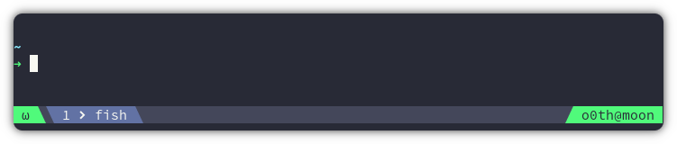
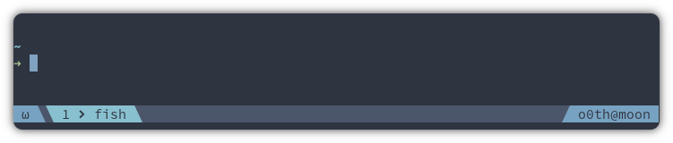

<p align="center">
  <a></a>
</p>

## Installation

### [Tmux Plugin Manager](https://github.com/tmux-plugins/tpm)

Add this line in your `.tmux.conf`

```bash
set -g @plugin 'o0th/tmux-nova'
```

Hit <kbd>Prefix</kbd> + <kbd>I</kbd> to fetch the plugin and source it.

### Manual

Clone the repository

```bash
git clone git@github.com:o0th/tmux-nova.git ~/.tmux/plugins/tmux-nova
```

Add this line in your `.tmux.conf`

```bash
run-shell ~/.tmux/plugins/tmux-nova/nova.tmux
```

Reload TMUX

```bash
tmux source-file ~/.tmux.conf
```

## Simple configuration

To achieve the screenshot look use this configuration

```bash
set -g @plugin 'o0th/tmux-nova'

set -g @nova-nerdfonts true
set -g @nova-nerdfonts-left 
set -g @nova-nerdfonts-right 

set -g @nova-segment-mode "#{?client_prefix,Ω,ω}"
set -g @nova-segment-mode-colors "#50fa7b #282a36"

set -g @nova-segment-whoami "#(whoami)@#h"
set -g @nova-segment-whoami-colors "#50fa7b #282a36"

set -g @nova-pane "#I#{?pane_in_mode,  #{pane_mode},}  #W"

set -g @nova-rows 0
set -g @nova-segments-0-left "mode"
set -g @nova-segments-0-right "whoami"
```

## Nord configuration

If you prefer the nord color palette

<p align="center">
  <a></a>
</p>

```bash
set -g @plugin 'o0th/tmux-nova'

set -g @nova-nerdfonts true
set -g @nova-nerdfonts-left 
set -g @nova-nerdfonts-right 

set -g @nova-pane-active-border-style "#44475a"
set -g @nova-pane-border-style "#282a36"
set -g @nova-status-style-bg "#4c566a"
set -g @nova-status-style-fg "#d8dee9"
set -g @nova-status-style-active-bg "#89c0d0"
set -g @nova-status-style-active-fg "#2e3540"
set -g @nova-status-style-double-bg "#2d3540"

set -g @nova-pane "#I#{?pane_in_mode,  #{pane_mode},}  #W"

set -g @nova-segment-mode "#{?client_prefix,Ω,ω}"
set -g @nova-segment-mode-colors "#78a2c1 #2e3440"

set -g @nova-segment-whoami "#(whoami)@#h"
set -g @nova-segment-whoami-colors "#78a2c1 #2e3440"

set -g @nova-rows 0
set -g @nova-segments-0-left "mode"
set -g @nova-segments-0-right "whoami"
```

## Documentation

If you want to learn how to customize this theme have a look at the [documentation](documentation.md).


## Gallery

For more example have a look at the have a look at the [gallery](gallery.md).


## FAQ

**Why are my components being cut off or truncated?**
By default tmux set `status-left-length` to 20 characters and `status-right-length` to 40 characters,
which may cause components to be truncated or cut off if their combined length exceeds these limits.
To resolve this issue you can adjust this default values with:

```bash
# .tmux.conf
set -g status-left-length 100
set -g status-right-length 100
```

## Contributors

[](https://github.com/goolmoos)[](https://github.com/fky2015)[](https://github.com/ofirgall)[](https://github.com/codepeon)